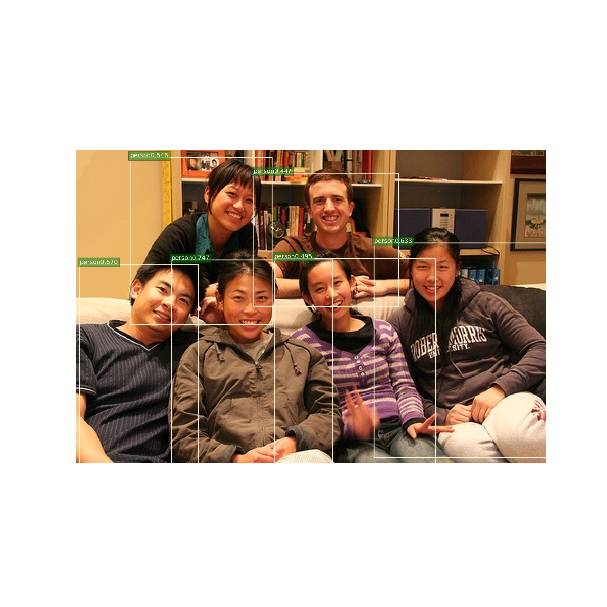

# YOLOF
Tensorflow implement YOLOF(You Only Look One Level Feaature) 

## Supports and Results 
  * GIOU. 
  * Smooth L1 loss.
  * Tensorflow pretrained resnet[model zoo](http://download.tensorflow.org/models/resnet_v1_50_2016_08_28.tar.gz )
  * Tensorboard visualize detection results When training. 
  * Best Result in Pascal VOC(0.63, train and test in VOC07).I guess in COCO will get a better performance? 
  * I have to say this result is not so good as RetinaNet[codes](https://github.com/JiXuKong/RetinaNet) and FCOS[codes](https://github.com/JiXuKong/FCOS), but the author did not provide their result in VOC, So I have no conference to make this code perform better. If anyone has a better result,I'll appreciate it if you share your experience. 

## Main difficulty 
  * GIOU did not converge! So I choosed Smooth L1 loss and this code support this two methods to regress boxes. If you find some Error about GIOU in my code or you can     find a way make it converge, Welcome to contact me!
  * Larger resolution may reach a better results, but it decrese the inference result largely. 

## Train/eval/demo 
 * If you want to train your own dataset, You can refer [FCOS]((https://github.com/JiXuKong/FCOS)) because they have similar code structure or you can contact me.  
## Detection
  *  
  *  
  *  
  *  
  *  
  *  
